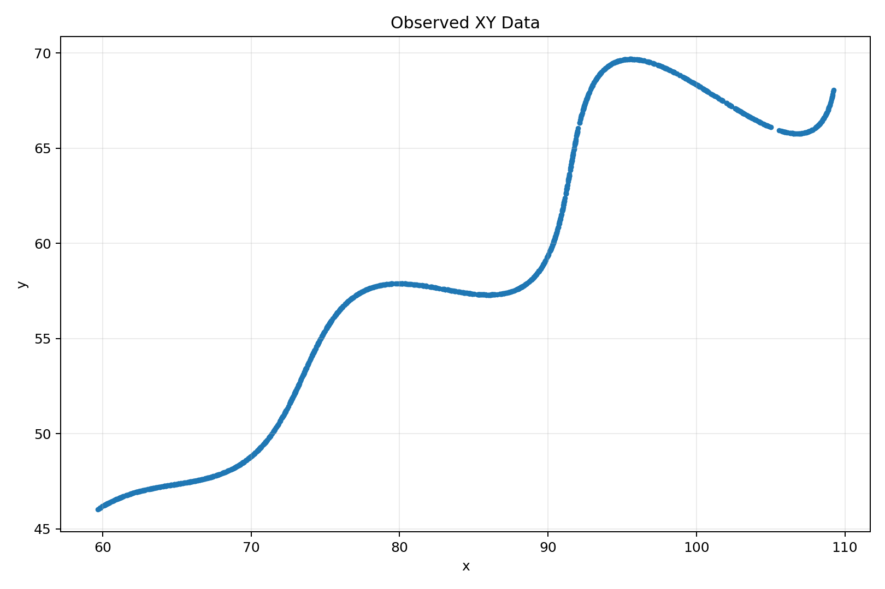
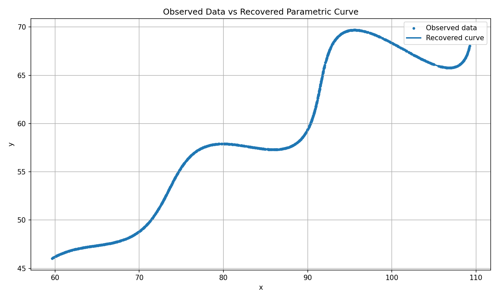

# FlamAI R&D Assignment — Parametric Curve Parameter Recovery
- **Desmos link:** https://www.desmos.com/calculator/mxidc3gcwo
## 1. Objective

The objective of this assignment is to recover the three unknown parameters
`θ`, `M`, and `X` from the provided `xy_data.csv` dataset.

The given parametric curve is:

\[
x(t)=t\cos(\theta)
-e^{M|t|}\sin(0.3t)\sin(\theta)+X
\]

\[
y(t)=42+t\sin(\theta)
+e^{M|t|}\sin(0.3t)\cos(\theta)
\]

The three unknown parameters are **θ**, **M**, and **X**.
The parameter constraints are:

**0° < θ < 50°**

**−0.05 < M < 0.05**

**0 < X < 100**

and:

**6 < t < 60**

The dataset contains 1500 observed `(x,y)` points.

---

## 2. Solution

The recovered parameters are:

| Parameter | Recovered value |
|---|---:|
| θ | **30.0000000000°** |
| θ | **0.5235987756 rad** |
| M | **0.0300000000** |
| X | **55.0000000000** |

Therefore, the final recovered parameters are:

| Parameter | Value |
|:---:|---:|
| **θ** | **30°** |
| **M** | **0.03** |
| **X** | **55** |

### Desmos / LaTeX submission string

Following the required submission format (values plugged into the given
parametric equation):

\left(t*\cos(0.5236)-e^{0.03\left|t\right|}\cdot\sin(0.3t)\sin(0.5236)+55,42+t*\sin(0.5236)+e^{0.03\left|t\right|}\cdot\sin(0.3t)\cos(0.5236)\right)

with domain `6 ≤ t ≤ 60`. Pasting this into Desmos parametric graphing
reproduces the observed curve to very high numerical accuracy (see Desmos link above).

### Validation Results

Running `src/validate.py` against the 1500 observed points gives:

| Metric | Value |
|---|---:|
| Observed points | 1500 |
| Uniformly sampled comparison points | 1497 |
| **L1 distance** | **1.469 × 10⁻⁴** |
| RMSE | 3.96 × 10⁻⁴ |

Both figures are effectively zero relative to the data's scale (x, y ~ 46–110),
confirming the recovered parameters reproduce the ground-truth curve almost exactly.

**Raw observed data:**



**Recovered curve overlaid on observed data:**



### How to Reproduce

```bash
pip install -r requirements.txt

# Recover theta, M, X from data/xy_data.csv
python -m src.fit

# Validate the fit (L1/RMSE + generates results/fitted_curve.png)
python -m src.validate

# Run the test suite
pytest tests/
```

---

## 3. Mathematical Reformulation

Define the translated coordinates:

\[
u = x - X
\]

\[
v = y - 42
\]

The original equations become:

\[
u = t\cos(θ)
-e^{M|t|}\sin(0.3t)\sin(θ)
\]

\[
v = t\sin(θ)
+e^{M|t|}\sin(0.3t)\cos(θ)
\]

Applying the inverse rotation gives:

\[
t = u\cos(θ) + v\sin(θ)
\]

and:

\[
r = -u\sin(θ) + v\cos(θ)
\]

Therefore:

\[
r = e^{M|t|}\sin(0.3t)
\]

This transformation separates the approximately linear coordinate `t`
from the oscillatory component `r`.

---

## 4. Residual Formulation

For a candidate parameter vector

\[
p = (θ, M, X)
\]

the transformed observations are:

\[
t_i = (x_i-X)\cos(θ) + (y_i-42)\sin(θ)
\]

\[
r_i = -(x_i-X)\sin(θ) + (y_i-42)\cos(θ)
\]

The model predicts:

\[
\hat{r}_i = e^{M|t_i|}\sin(0.3t_i)
\]

The residual for each observation is:

\[
ε_i = r_i-\hat{r}_i
\]
The parameters are estimated by minimizing these residuals subject to
the specified parameter bounds.

---

## 5. Parameter Estimation

The parameter recovery problem is solved as a bounded nonlinear least-squares
optimization using `scipy.optimize.least_squares`.

The optimizer estimates:

- \(\theta\): rotation angle
- \(M\): exponential growth/decay parameter
- \(X\): horizontal translation

The optimization respects the parameter bounds specified in the assignment:

\[
0^\circ < \theta < 50^\circ
\]

\[
-0.05 < M < 0.05
\]

\[
0 < X < 100
\]

The implementation is contained in:

```text
src/fit.py
src/objective.py
src/model.py
src/inverse.py
```
## Final Answer

The recovered unknown parameters are:

\[
\boxed{\theta=30^\circ}
\]

\[
\boxed{M=0.03}
\]

\[
\boxed{X=55}
\]

The fitted curve achieves:

- **L1 distance:** \(1.469\times10^{-4}\)
- **RMSE:** \(3.96\times10^{-4}\)

The complete plugged-in parametric equation is provided below and can be
directly entered into Desmos.
